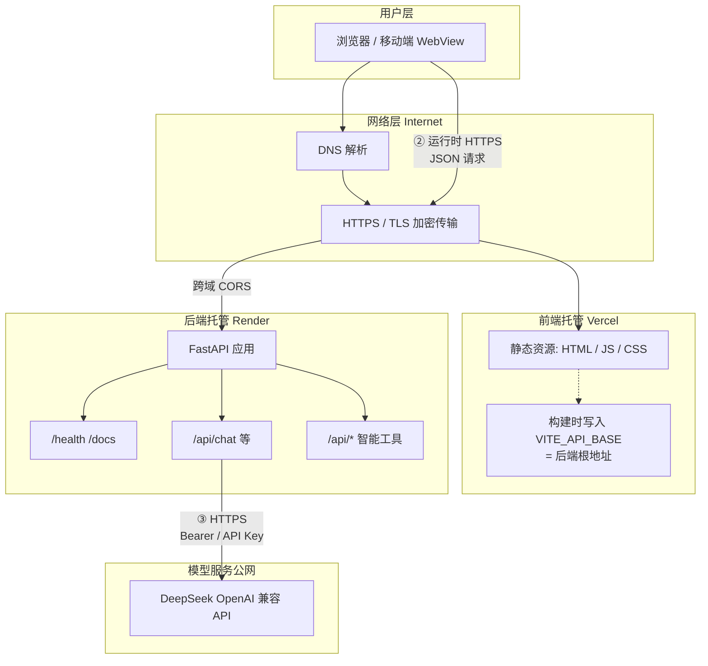
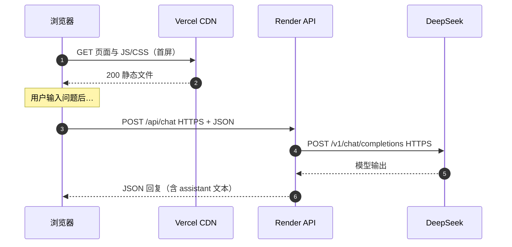
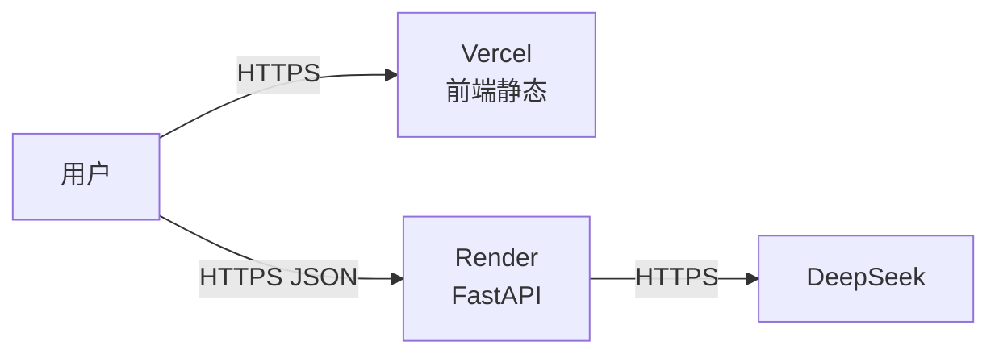

# 前后端与网络层通信 — PPT 用图

> 使用方式：把下面 **Mermaid** 代码块复制到 [https://mermaid.live](https://mermaid.live) ，右上角 **Actions → PNG/SVG** 导出后插入 PPT。  
> 若 PPT 不支持 Mermaid，用导出的 **PNG** 即可。

---

## 图 1：总体架构（分层 + 双域名）

展示：**静态前端** 与 **动态 API** 分离部署；浏览器在运行时跨域调用后端；后端再调用大模型。

**口播提示（可选）：**

1. **①** 用户先访问 Vercel，只拉静态页；API 地址已在构建时打进 JS。  
2. **②** 对话与工具在浏览器内通过 **HTTPS** 请求 Render 上的 **同源 API 前缀**（跨域由后端 `CORS` 放行）。  
3. **③** 需要生成内容时，由 **Render 服务端** 调用 DeepSeek，**密钥不经过浏览器**。

---

## 图 2：单次「政策问答」请求时序（网络视角）

适合讲清：**谁发起、谁中转、谁出答案**。

---

## 图 3：一页 PPT 用的「分层对照表」（无 Mermaid 也可直接做表格）

| 层级 | 部署位置 | 主要协议 | 典型内容 |
|------|-----------|----------|----------|
| 表现层 | 用户设备 | HTTPS | 浏览器执行 React，展示 UI |
| 边缘/静态 | Vercel | HTTPS | `*.vercel.app` 托管 `index.html` 与打包 JS |
| 应用 API | Render | HTTPS | `*.onrender.com` FastAPI `/api/*` |
| 外部智能 | DeepSeek 等 | HTTPS | 仅后端出网调用，返回生成文本 |

---

## 图 4：简化拓扑（适合做「一页一个大图」）

---

## 图例说明（可放在 PPT 脚注）

- **双域名**：`*.vercel.app` ≠ `*.onrender.com`，属正常前后端分离架构。  
- **安全**：`OPENAI_API_KEY` 仅存在于 Render 环境变量，不出现在 Vercel 构建产物与 Git 仓库。  
- **冷启动**：Render 免费实例休眠后，**首次 API 请求**可能延迟明显增加。
